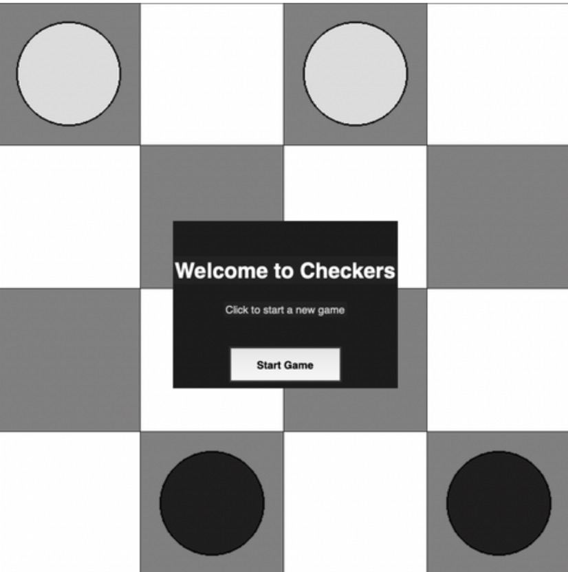

# 4x4 Checkers with AI

This is a Python implementation of a simplified Checkers game on a 4×4 board, featuring:

- 🎮 Playable GUI using Tkinter  
- 🧠 AI opponent using the Minimax algorithm with alpha-beta pruning  
- 🏆 Win and draw detection with replay option  
- 🧱 Object-oriented design for clean separation of logic and UI  

---

## 🧠 AI Strategy

The AI uses the **Minimax algorithm** enhanced with **alpha-beta pruning** to evaluate game states efficiently:

- Retrieves all legal moves for the current player
- Simulates each possible move recursively
- Evaluates board states based on piece count and king value
- Prunes unpromising branches to reduce computation
- Selects the best possible move assuming the opponent plays optimally

---

## 🛠️ Technologies Used

### 💾 Backend
- Python
- Custom logic in `Board`, `Man`, and `King` classes

### 🎨 Frontend
- Tkinter GUI for interaction
- Drag-and-drop for black pieces
- Animated board and pop-up screens
  


---

## ▶️ How to Run

1. Make sure you have Python installed (≥ 3.7)
2. Clone or download the repository
3. Run:

```bash
python main.py
